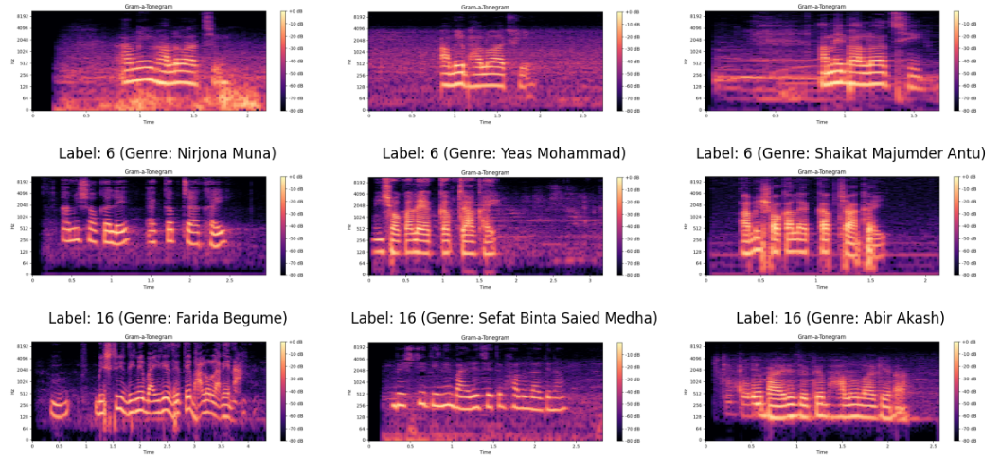
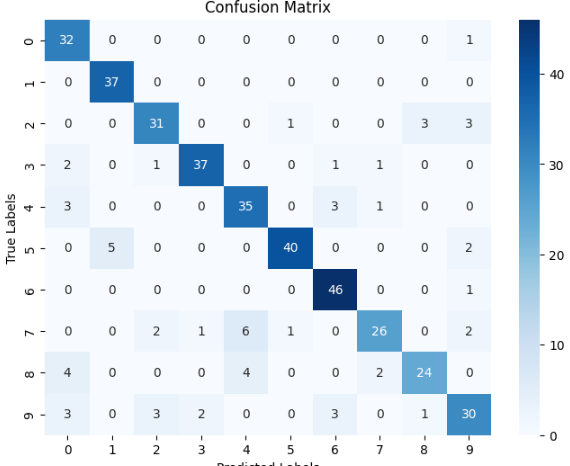

# Genre-Detection-Using-Gramtonegram
# 🎵 Song Genre Classification Using Gammatonegram Features 🎶  

## 🌟 Overview  
This project demonstrates the classification of songs into **10 different genres** using advanced audio processing and machine learning techniques. By converting songs into **gammatonegrams**, addressing class imbalance with **SMOTE**, and training a robust model, we achieved an impressive **86% accuracy**!  

---

## 📂 Dataset  
- **🎼 Genres**: 10 (e.g., Rock, Jazz, Classical, Pop, etc.)  
- **📀 Samples**: 100 songs per genre, organized in genre-specific folders.  
- **🎧 File Type**: Audio files (.wav, .mp3, etc.).  

---

## 🔍 Methodology  

### 🛠️ 1. Preprocessing  
- Convert raw audio into **gammatonegrams** for effective feature representation.  

### 🧑‍🔬 2. Feature Extraction  
- Extract features from the gammatonegrams.  
- Handle class imbalance using **SMOTE (Synthetic Minority Oversampling Technique)** to ensure fair training.  

### 🤖 3. Model Training  
- Train a machine learning model using the extracted features.  
- Evaluate the model's performance and refine hyperparameters to achieve optimal accuracy.  

---

## 🎯 Results  
- **Test Accuracy**: **84%** ✅  
- Confusion Matrix
- 

---
